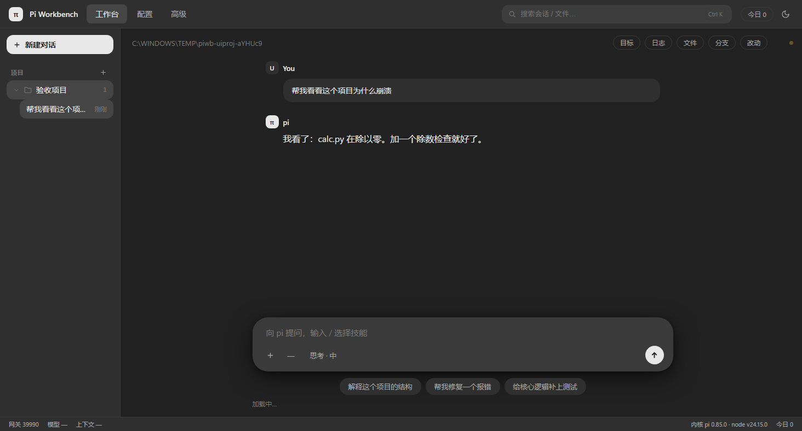
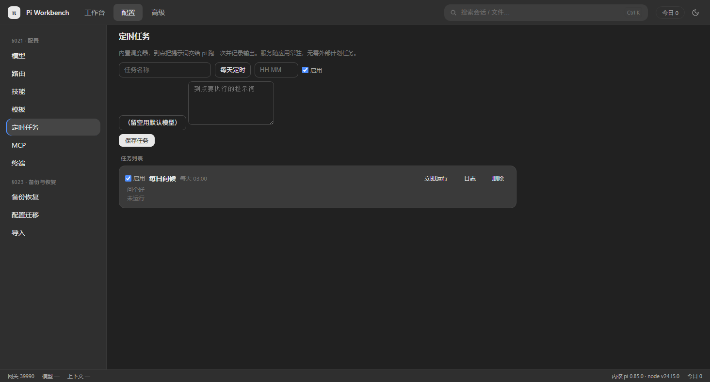
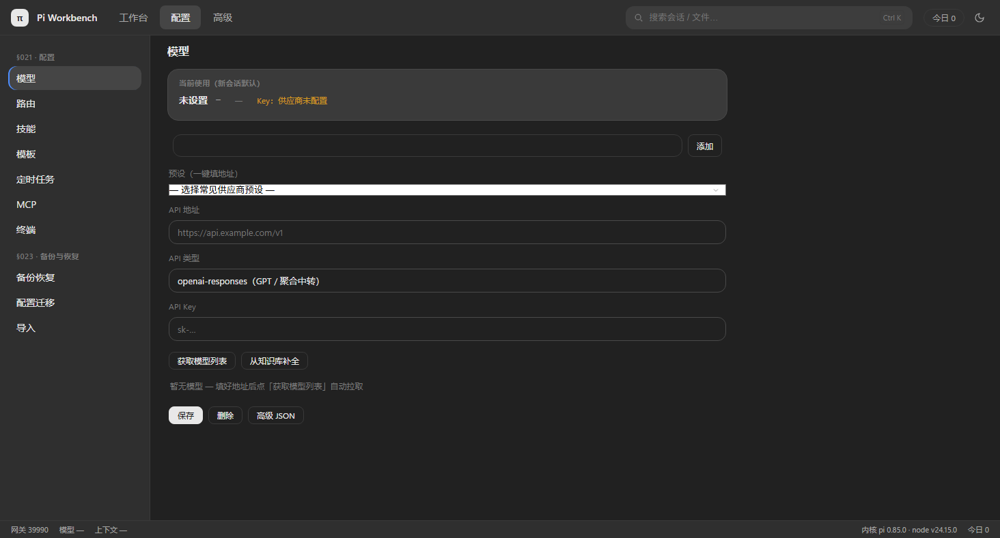

# pi-workbench

[English](README.en.md)

[](https://github.com/cullysu/pi-workbench/actions/workflows/ci.yml)

**pi-workbench** — a local-first desktop workbench for the [pi coding agent](https://github.com/earendil-works/pi) (`@earendil-works/pi-coding-agent`). 跨平台桌面应用：Windows 双壳（Electron 完整壳 + Tauri 轻量壳，安装包 ≈32MB）、Linux AppImage、macOS dmg（arm64/x64），中文界面。

不 fork、不改 pi。工作台以子进程运行 `pi --mode rpc`（stdin/stdout JSONL）驱动 pi 本体：会话文件是 pi 原生格式（`~/.pi/agent/sessions`），自定义模型在 `~/.pi/agent/models.json`，与 pi CLI 完全互通。

| | |
|---|---|
|  |  |
|  | |

## 功能

- **桌面壳**：顶栏 工作台 / 配置 / 高级；项目树左栏（对话挂在项目下，⊕ 就地新建）；状态栏
- **多供应商**：`models.json` 可配任意 OpenAI-compatible / Anthropic / Google 兼容上游；页面填 URL + API Key 即可自动拉取模型列表、逐模型真实回信测试、单选默认模型
- **当前配置一览**：默认模型 / API 地址 / Key 状态常驻显示，一键在多套供应商配置间切换
- **回退路由**：模型级 fallback 链 + 冷却恢复；失败自动沿链切换并重发（等 pi 自身 auto_retry 放弃后才切）
- **技能**：扫描 pi 的 Agent Skills（全局 + 项目），开关直接控制下次会话是否加载
- **用量与缓存**：今日 / 按供应商 / 按模型统计，缓存命中率；每轮回复显示输入 / 输出 / 缓存率
- **导入**：Codex / Claude / ZCode / OpenCode / OMP / Gemini / Grok CLI / Aider 历史会话只读浏览
- **周边**：定时任务（每天定时 / 间隔分钟，到点无头运行提示词并逐次落日志）、Prompt 模板、目标模式自动续跑、实时事件日志、项目文件浏览、git diff、终端、会话导出 Markdown、备份恢复、配置迁移
- **安全**：本地服务只绑 127.0.0.1，每次启动生成随机 token，HTTP API 与 WebSocket 均校验，其它本地进程无法未授权调用
- **MCP**：内置桥接扩展，读取标准 `~/.pi/agent/mcp.json`（与 Claude/Cursor 同格式），把 MCP 工具注册为 pi 原生工具，配置页一键安装；给某个 server 加 `"lazy": true` 可改为零启动成本（首次调用才 spawn，暴露 `mcp_<srv>_list` / `mcp_<srv>_call` 两个元工具）


## 架构一览

- **单文件服务端**：`server.mjs`（≈1000 行）= 42 个具名 handler + 一张声明式路由表 + 单派发循环；每个端点可按名检索，鉴权与 404 各归一处
- **逻辑全部在 `lib/` 九个模块**：工厂 + ctx 显式注入，**每个工厂启动即校验接线契约**（缺一个依赖直接崩在启动，而不是某天早上静默哑火）；IO 只有三条原语（`lib/io.mjs`：有界遍历 / 头字节预览 / 分块 JSONL / 子进程收集）
- **安全默认**：每启动随机 token + CSP nonce（无 `unsafe-inline` 脚本）、DOMPurify fail-closed 消毒、`path.relative` + realpath 双层路径包含校验（symlink/junction 也逃不出项目根）、Origin 校验、供应商 URL 强制 http(s) 且响应限流、配置原子写入（tmp+rename，损坏自动留证）、备份 zip CRC + 解压上限、定时任务 ID 白名单
- **四层验证体系**（全部入库可复跑）：`eslint` 全仓 0/0 → 23 条 API 测试 + 47 路由全量扫描（`scripts/route-sweep.py`）→ 集成探针（`scripts/ws-probe.mjs`：spawn 真 pi 子进程走完 WS 全链）→ 浏览器级探针（`scripts/ui-probe.mjs`：headless Chromium 加载真实面板，断言回放气泡/17 面板/零 console error 并出截图）
- **五通道构建**：CI 在 main 分支每次 push 产出 Windows Electron NSIS + Windows Tauri NSIS + Linux AppImage + macOS dmg（arm64/x64）五件安装包，AppImage 出包前在 xvfb 里真实启动并轮询 HTTP 200、并校验 /api/kernel 报告内置 pi 才算过；组装时生成 sha256 manifest，壳启动前先验运行时完整性（安装损坏会在启动时明确报错而不是半死不活）；出包同时产出 CycloneDX SBOM artifact

## 安装

从 [GitHub Releases](../../releases) 下载对应平台的安装包（以 1.1.3 为例）：

| 平台 | 文件 |
|---|---|
| Windows (Electron) | `PiWorkbench-Setup-<版本>.exe` |
| Windows (Tauri 轻量壳) | `PiWorkbench-<版本>-Tauri-x64-setup.exe` |
| Linux | `PiWorkbench-<版本>-linux.AppImage` |
| macOS (Apple Silicon) | `PiWorkbench-<版本>-macOS-arm64.dmg` |
| macOS (Intel) | `PiWorkbench-<版本>-macOS-x64.dmg` |

安装包**内置 Node 运行时**（Windows/Linux 为 x64 官方二进制，macOS 为 x64 —— Apple Silicon 经 Rosetta 运行），**无需本机安装 Node.js**。`package.json` 的 `engines >= 22.13` 仅约束源码开发环境：

- 跟随系统语言（中文 / English），可选安装路径，桌面 + 开始菜单快捷方式
- 覆盖升级保留配置与会话；卸载不影响 `~/.pi-workbench` 与 `~/.pi`
- 首次启动自动解压内置运行时（含捆绑的 Node 与 pi，开箱即用）

## 文档

- [故障排查](docs/TROUBLESHOOTING.md)：启动失败、端口占用、MCP 不连、会话为空、日志位置
- [贡献指南](CONTRIBUTING.md)：环境搭建、必须跑的门禁、代码约定
- [变更日志](CHANGELOG.md)：每个版本的行为变化
- 前端库版本：[public/vendor/README.md](public/vendor/README.md)

## 配置

所有个人配置都在本机，不进仓库：

- `~/.pi-workbench/config.json` — 工作台配置（项目、主题、语言、默认模型、技能开关）
- **密钥说明**：API key 存于 `~/.pi/agent/models.json`（`$ENV` 写法可引用环境变量，面板接口对明文 key 只回 `***`，编辑时留空即保持）；备份 zip 为还原会**包含明文 key**，请妥善保管
- `~/.pi-workbench/routing.json` — 回退链与冷却状态
- `~/.pi/agent/models.json` — 供应商与模型（pi 原生格式）

供应商密钥支持 `$ENV_NAME` 环境变量引用；也可在 `config.json` 里配置可选的 `relaySecret`（从本机其它应用的 settings.json 读取令牌，仅驻内存，需指纹校验）。仓库本身不含任何密钥、地址或账号信息。

## 开发

```bash
npm install
node server.mjs        # http://127.0.0.1:32123
npm run electron       # 或: node_modules\.bin\electron .
```

打包：`npx electron-builder --win nsis --x64`（产物在 `dist_electron/`，不随 git 提交）。

测试：`npm test`（node:test，在隔离 HOME 里起真实服务端打全量 API）；CI：push 到 main 自动跑双平台测试并出 Windows 安装包 artifact。

## License

MIT — 见 [LICENSE](LICENSE)。第三方组件见 [ThirdPartyNotices.txt](ThirdPartyNotices.txt)。
